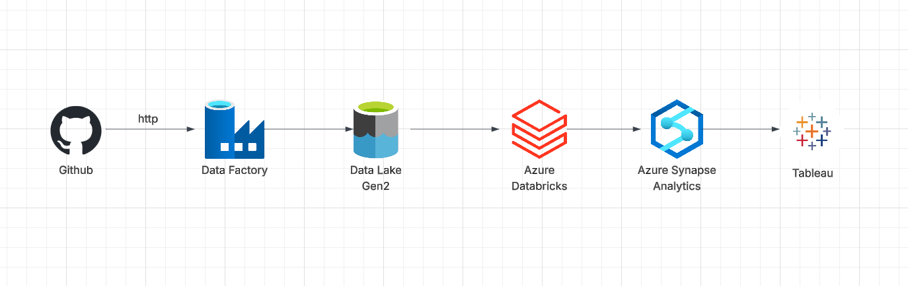

# E2E-Azure-Olympic-data-analysis

## Project Diagram

## Project Summary:
- Implemented Azure Data Factory to orchestrate ETL workflows.
- Store and managed data in Azure Data Lake Storage (Gen2).
- Performed data cleaning and transformation using Azure Databricks.
- Leveraged Azure Synapse Analytics for querying processed data and deriving insights.
- Enabled informed decision-making process through Tableau visualizations.